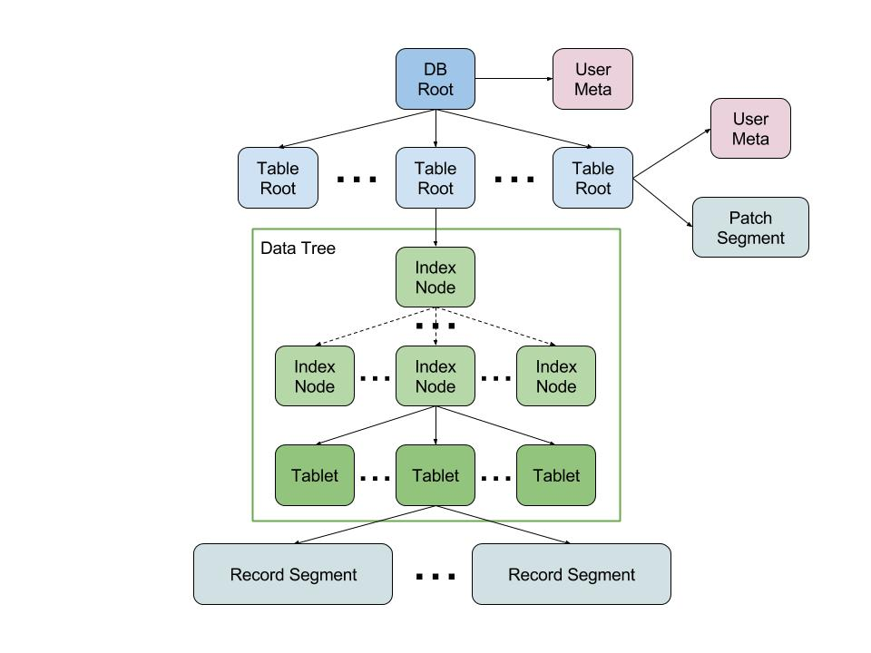

MerkleDB Design Doc
===================

The high-level semantics of this library are similar to a traditional key-value
data store:

- A _database_ is a collection of _tables_, along with some user metadata.
- Tables are collections of _records_, which are identified uniquely within the
  table by an id key.
- Each record is an associative collection of _fields_, mapping field names to
  values.
- Values may have any type that the underlying serialization format supports.
  There is no guarantee that all the values for a given field have the same
  type.


## Goals

The primary design goals of MerkleDB are:

- Flexible schema-free key-value storage.
- High-parallelism reads and writes to optimize for bulk-processing, where a
  job computes over most or all of the records in the table, but possibly only
  needs access to a subset of the fields in each record.

Secondary goals include:

- Efficient storage utilization via deduplication and structural sharing.
- Light-weight versioning and copy-on-write to support immutable reads.
- Building on storage and synchronization abstractions to support hosted service
  backends.

Non-goals:

- High-frequency, highly concurrent writes. Initial versions will have simple
  database-wide locking for updates.
- Access control. In this library, all authentication and authorization is
  deferred to the storage layers backing the block store and ref manager.


## Storage Structure

A database is stored as a _merkle tree_, which is a type of
[merkle DAG](https://github.com/greglook/merkledag-core) structure.
Each node in the tree is an immutable [content-addressed
block](https://github.com/greglook/blocks) identified by a
[cryptographic hash](https://github.com/multiformats/clj-multihash) of its byte
content. The data in each block is serialized with a _codec_ and wrapped in
[multicodec headers](https://github.com/multiformats/clj-multicodec) to support
format versioning and feature evolution.  Initial versions will use the
[CBOR](https://github.com/greglook/clj-cbor) format for node data and Snappy for
compression.



Within a node, references to other nodes are represented with _merkle links_,
which combine a multihash target with an optional name and the recursive size
of the referenced block. These links are themselves part of the hashed
content of the node, so a change to any part of the tree must propagate up to
the root node. The entire immutable tree of data at a specific version can
therefore be identified by the hash of the database root node.

### Database Roots

The root of a database is a block which contains database-wide settings and
maps table names to _table root nodes_.

```clojure
{:data/type :merkle-db/db-root
 :merkle-db.db/tables {String MerkleLink}
 :time/updated-at Instant
 ,,,}
```

Database roots may contain additional arbitrary entries to support user-set
metadata on the table. For example, this could be used to add a
`:data/description` value to the database.

### Table Roots

A table root is a node which contains table-wide settings and links to
the tree of record data. The records in a table are grouped into _partitions_,
which each contain the data for a contiguous, non-overlapping range of record
keys.

```clojure
{:data/type :merkle-db/table-root
 :merkle-db.data/count Long
 :merkle-db.data/families {Keyword #{field-key}}
 :merkle-db.key/lexicoder Keyword
 :merkle-db.index/branching-factor Long  ; e.g. 256 children
 :merkle-db.partition/limit Long         ; e.g. 100,000 records
 :merkle-db.table/data MerkleLink
 :merkle-db.table/patch MerkleLink
 :time/updated-at Instant
 ,,,}
```

Similar to the database root, tables may also contain additional entries to
attach user-specified metadata to them.

### Data Index Trees

Index trees are modeled after a [B+ tree](https://en.wikipedia.org/wiki/B%2B_tree)
and contain both internal index nodes and leaf partitions. Records in the tree
are sorted by their _id key_, which uniquely identifies each record within
the table. Record keys are just bytes, allowing for pluggable key serialization
formats.

The tree nodes contain a count of the records under them, so the index is also
an [order statistic tree](https://en.wikipedia.org/wiki/Order_statistic_tree).
A similar metric for the linked block sizes allows for quick recursive data
sizing.

```clojure
{:data/type :merkle-db/index
 :merkle-db.data/count Long
 :merkle-db.index/height Long
 :merkle-db.index/keys
 [key-bytes-A  ; encoded key A
  key-bytes-B  ; encoded key B
  ...
  key-bytes-Z] ; encoded key Z
 :merkle-db.index/children
 [link-0       ; link to subtree containing pk < A
  link-1       ; link to subtree containing A <= pk < B
  link-2       ; link to subtree containing B <= pk < ...
  ...
  link-26]}    ; link to subtree containing Z <= pk
```

### Partitions

Partitions hold contiguous non-overlapping ranges of records, sorted by id key.
The records' field data is stored in _tablets_, which are linked from each
partition.

Unlike the internal nodes, partitions may contain significantly more entries
than the index tree's branching factor. When partitions grow above this limit,
they are split into two smaller partitions to enable better parallelism when
processing the table.

Tables may define _families_ of fields which are often accessed together, as a
storage optimization for queries. Each family of fields will be written in
separate tablet in each partition, allowing queries to read from only the
families whose data they require.

Partitions always contain at least one _base_ tablet, which is used to store
the data from any fields not grouped into a family. _All_ record keys will be
present in the base tablet, even if there is no field data present. This makes
sure that the full sequence of keys can be enumerated with only the base.

```clojure
{:data/type :merkle-db/partition
 :merkle-db.data/count Long
 :merkle-db.data/families {Keyword #{field-key}}
 :merkle-db.partition/limit Long
 :merkle-db.partition/membership BloomFilter
 :merkle-db.partition/first-key key-bytes
 :merkle-db.partition/last-key key-bytes
 :merkle-db.partition/tablets
 {:base MerkleLink
  family-key MerkleLink}}
```

Partitions store family information locally because occasionally tables may be
in a transitionary state where some partitions' family configuration does not
match the desired one set in the table root.

### Data Tablets

The actual record data is stored in the _tablets_.

```clojure
{:data/type :merkle-db/tablet
 :merkle-db.tablet/records
 [[key-bytes-a {:abc 123, "xyz" true, ...}]
  [key-bytes-b {:abc 456, "xyz" false, ...}]
  ...]}
```

Tablets should not link to any further nodes, and are probably the best
candidate for a custom encoding format. In particular, caching field names at
the beginning of the data and referencing them by number in the actual record
bodies would probably save a lot of space. This may not be a huge win compared
to simply applying compression to the entire tablet block, however.

### Patch Tablets

In addition to the main data tree, tables may contain a _patch tablet_ linked
directly from the root node. This tablet holds complete records and tombstones
sorted by pk which override the main data tree. This is similar to Clojure's
`PersistentVector` tail and allows for amortizing table updates across many
operations. Later, the contents of the patch tablet can be flushed together to
update the main data tree.

Insertions and updates write new full record values to the patch tablet. This
requires a read from the main data tree to fill in values, but saves
tremendously on storage space. Deletions add a tombstone marker to the patch
tablet so that later reads can elide the record.

To perform a batch read, first the patch tablet is consulted. If it contains a
tombstone, the record was deleted. If it contains data, that is taken as the
full record content. If any records were not found, they are read from the main
data tree as normal.

To perform a range scan, both the data tree and the patch tablet are read with
the same range criteria. In the resulting sequence, any records appearing in the
patch tablet replace the values from the data tree. Tombstones will remove a
record from the result if it would have been present; patch data will replace
(not merge with) the data in the tree, or insert the record if it wasn't already
present.


## Client API

The library should support the following client interface:

### Connection Operations

A _connection_ is a long-lived handle to the backing data store and db ref
manager. It can be used to open databases for reading and writing.

```clojure
; Create a new connection to a backing block store and reference manager.
; Options may include serialization, caching, and other configuration.
(conn/connect node-store ref-manager & opts) => conn

; List information about the current version of each database present.
(conn/list-dbs conn opts) =>
({:merkledag.node/id Multihash
  :merkle-db.db/name String
  :merkle-db.db/version Long
  :merkle-db.db/committed-at Instant}
 ...)

; List information about the version history of a specific database.
(conn/get-db-history conn db-name) => (db-version ...)

; Initialize a new database with some optional root data.
(conn/create-db! conn db-name root-data) => db

; Drop a database ref. Note that this will not remove the block data, as it
; may be shared.
(conn/drop-db! conn db-name)

; Open a database for use. An optional argument may be provided, which will
; return the last committed database version occurring before that time.
(conn/open-db conn db-name opts) => db

; Ensure all data has been written to the backing block store and update the
; database's root in the ref manager.
(conn/commit! conn db) => db'

; You can optionally commit the database under a new name, creating a virtual
; copy of the database.
(conn/commit! conn db-name db) => db'
```

### Database Operations

Databases provide an immutable wrapper around the dynamic connection to the
block and ref stores. Once you are interacting with the database object, most
operations will return a locally-updated copy but not actually change the
backing storage until `commit!` is called.

Database values are map-like, and present both the database version attributes
(`:merkledag.node/id`, `:merkle-db.db/name`, `:merkle-db.db/version`,
`:merkle-db.db/committed-at`) as well as the attributes stored in the database
root node.

```clojure
; Databases provide direct keyword access to their properties:
(into {} db) =>
{:merkledag.node/id Multihash
 :merkle-db.data/size Long
 :merkle-db.db/committed-at Instant
 :merkle-db.db/name String
 :merkle-db.db/version Long
 :merkle-db.db/tables {table-name MerkleLink}
 :time/updated-at Instant
 ,,,}

; List information about the tables within a database.
(db/list-tables db opts) =>
({:merkledag.node/id Multihash
  :merkle-db.table/name String
  :merkle-db.data/size Long}
 ...)

; Add a new table to the database. Options may include pre-defined field
; families and metadata.
(db/create-table db table-name opts) => db'

; Return a reified value representing the table.
(db/get-table db table-name) => table

; Update the named table. The function `f` will be called with the current
; table value, followed by any provided arguments. The result will be used as
; the new table.
(db/update-table db table-name f & args) => db'

; Remove a table from the database.
(db/drop-table db table-name) => db'

; Flush local changes to the backing store.
(db/flush! db) => db'
```

### Table Operations

Tables are collections of records, identified by a string name. Each table name
must be unique within the database. These operations provide a high-level
interface for accessing and manipulating record data. Record maps are returned
with both rank and the id key attached as metadata.

The lookup functions all take a set of `fields` to return
information for. This helps reduce the amount of work done to fetch undesired
data from the store. If the fields are `nil` or not provided, all record data
will be returned.

```clojure
; Scan the records in a table, returning a sequence of data for the given set of
; fields. If start and end keys or indices are given, only records within the
; bounds will be returned (inclusive). A nil start or end implies the beginning
; or end of the data, respectively.
;
; - fields
; - patch-merge
; - from-key
; - to-key
; - from-index
; - to-index
; - offset
; - limit
(table/scan table opts) => ([key record] ...)

; Read a set of records from the database, returning data for the given set of
; fields for each located record.
(table/get-records table record-keys fields) => ([key record] ...)

; Write a collection of records to the database, represented as a map of record
; key values to record data maps.
(table/write table records) => table'

; Remove a set of records from the table, identified by a collection of record
; keys.
(table/delete table record-keys) => table'
```

### Partition Operations

Partitions divide up the record keys into ranges and are the basic unit of
parallelism. These operations are lower-level and intended for use by
high-performance applications.

```clojure
; List the partitions which compose the blocks of record key ranges for the
; records in the table.
(table/list-partitions table) =>
({:merkledag.node/id Multihash
  :merkle-db.data/count Long
  :merkle-db.data/size Long
  :merkle-db.partition/first-key key-bytes
  :merkle-db.partition/last-key key-bytes}
 ...)

; Read all the records in the given partition, returning a sequence of data for
; the given set of fields.
(table/read-partition table node-id fields) => ([k record] ...)

; Rebuild a table from a sequence of new or updated partitions. Existing table
; settings and metadata are left unchanged.
(table/rebuild table partition-ids) => table'
```


## Use Cases

This section details how to use MerkleDB to satisfy various usage patterns.

### Random Access

For basic usage, the database records can be accessed directly using the
high-level record operations. This will generally not be as performant, but is
sufficient for simple use-cases.

### Bulk Read

Partitions provide a natural grain to parallelize reads over. Either the whole
table or the partitions covering a specific range of keys can be selected for
querying and read in parallel. Each partition and the corresponding tablets
only need to be read by a single job.

Choosing field families which align with the types of queries done over the
data will improve IO efficiency, because only the required tablets will be
loaded for each partition.

### Bulk Update

Doing large bulk writes with unsorted record keys will generally update most of
the partitions within a table. In this case, using the high-level write
operation will generally not be very efficient. Instead, updates may be done in
parallel by applying the following method to each table:

1. List the partitions in the table to be updated.
2. Divide up the record keyspace into ranges matching the partitions.
3. Group the record updates into batches based on which partition's range they
   fall into.
4. In parallel, process each batch of updates and existing partition to produce
   a sequence of output partitions (for example, there may be more than one if
   the partition exceeds the size limit and splits). Write the updated tablets
   and new partitions to the backing block store.
6. Build a new index tree over the new set of partitions and update the table.

Choosing field families which align with the types of writes to the table will
reduce IO and improve storage efficiency, because the existing tablets can be
re-used from the current version.

### Time-Series Data

This is also known as "append-only" or "log-style" data. Writes only ever add
new data to the table, and deletions are generally rare and occur on large
blocks of old data (aging).

In order to support this pattern, the record keys must be monotonically
increasing. This way, new batches of data can be written as a new partition,
whose record keys are all greater than any keys already in the table. The new
partition is appended to the sequence of partitions and a new index tree is built
to incorporate it.

For reads from time-series data, it is desirable to find out only "new"
information to enable incremental processing. Because partitions are immutable
and shared broadly, a simple hash id comparison can be used to detect partitions
added or changed between two versions. The fact that partitions don't overlap
makes it safe for consumers to assume all new partitions are new data.

### Logical Record Versions

Logical versions make it possible to write a record with version _v_, then later
try to write version _v-1_ and wind up with the database still reflecting
version _v_. This makes writes idempotent, guaranteeing the database always
reflects the latest version of a record.

Logical versions can be implemented with custom record fields and read/rebuild
data loading logic.

**TODO:** Reads/writes need to accept a "merge" function which takes the
existing data and the new data and returns the data to use.

### Transaction Metadata

Reified transactions can be implemented by adding custom record fields on write
and utilizing the database-level user metadata to store information about the
transactions. Such metadata might include the timestamp, author, commit message,
etc.

**TODO:** It might be good to formalize this with some kind of middleware.
