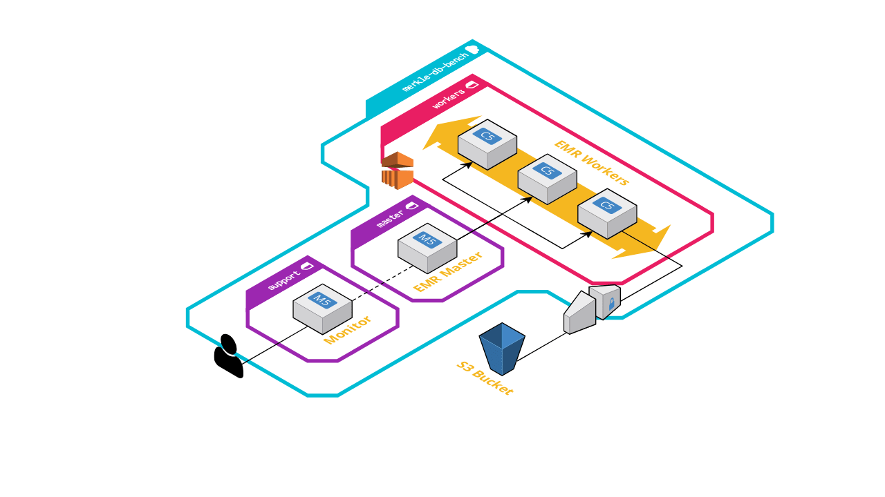

MerkleDB Benchmark Cluster
==========================

This directory holds configuration and scripts for running benchmarking tasks
against the MerkleDB code. This is accomplished by spinning up an Elastic Map
Reduce (EMR) cluster in AWS along with some supporting infrastructure to capture
metrics from the running jobs.



The diagram above shows the high-level architecture of the cluster. An EMR
cluster with a single master and multiple worker nodes is paired with an EC2
instance which serves as a gateway and a monitor for the task metrics.


## Setup

Follow these steps to prepare a cluster for testing.

### Tools

In order to use these configs, you'll need the following tools installed:

- [aws-cli](https://aws.amazon.com/cli/)
- [terraform](https://www.terraform.io/)
- [ansible](https://www.ansible.com/)

You'll need an AWS account and a corresponding IAM access keypair. Running the
cluster will cost some money, but it can be torn down once the tests are
complete.

### Data Storage

In order to hold the test data, task jars, and outputs, you will need to set up
an S3 bucket that will persist between runs. You will need to provide this bucket name to
Terraform; you can either do that at runtime or save it to a variable file in
`terraform/terraform.tfvars`:

```
# Custom benchmark settings
s3_data_bucket = "BUCKET_NAME"
```

You can also use this file to configure other variables such as the cluster
`master_type`, `worker_type`, and `cluster_size`.

### Bootstrap Resources

The EMR cluster uses [bootstrap actions](https://docs.aws.amazon.com/emr/latest/ManagementGuide/emr-plan-bootstrap.html)
to set up some extra software. This pulls scripts from S3 and executes them on
each machine beforee the cluster starts. Specifically, this installs
[Solanum](https://github.com/greglook/solanum) and the related configuration to
perform host monitoring, and the [riemann-jvm-profiler](https://github.com/amperity/riemann-jvm-profiler)
jar.

Clone the riemann-jvm-profiler repo and build the uberjar, then copy it into the
[bootstrap](bootstrap) directory.

```sh
$ git clone git@github.com:amperity/riemann-jvm-profiler.git
$ cd riemann-jvm-profiler
$ lein uberjar
$ cp target/riemann-jvm-profiler-0.1.0-standalone.jar ../bootstrap/riemann-jvm-profiler.jar
```

**TODO:** publish a release so this doesn't need to be built manually

### Build Infrastructure

Once ready, spin up the benchmark cluster with terraform:

```sh
$ cd terraform
$ terraform init
$ terraform apply
```

This will run for a while and create all of the necessary AWS resources. Part of
this process involves using Ansible to configure the monitor instance, which is
responsible for collecting metrics from the tests. Once the command returns, you
should see a few outputs including the names of the monitor and cluster master
instances:

```
Outputs:

cluster_id = j-XXXXXXXXXXXXX
cluster_master_dns = ip-XX-XX-XX-XX.us-west-2.compute.internal
monitor_instance = ec2-XX-XX-XX-XX.us-west-2.compute.amazonaws.com
```

Open the `monitor_instance` address in a browser and you should see the
benchmark landing page, with links to the various web interfaces exposed by the
cluster.


## Running Tests

**TODO:** fill in this section

Build an uberjar with the task code and upload it to the bucket:

```sh
$ aws s3 cp target/uberjar/task.jar s3://my-test-bucket/jars/task.jar
```

Write out a JSON file describing the task step to run:

```json
[
  {
    "Type": "CUSTOM_JAR",
    "Name": "MerkleDB Benchmark",
    "ActionOnFailure": "CONTINUE",
    "Jar": "command-runner.jar",
    "Args": [
      "spark-submit",
      "--deploy-mode", "cluster",
      "s3://my-test-bucket/jars/task.jar",
      "...args..."
    ],
    "MainClass": "string",
    "Properties": "string"
  }
]
```

Use the AWS CLI to submit the step to the cluster:

```sh
$ aws emr add-steps \
    --cluster-id j-XXXXXXXXXXXXX \
    --steps steps.json
```

**TODO:** how to enable the riemann profiler? Need to apply the following java arg:

```
-javaagent:riemann-jvm-profiler.jar=prefix=merkle-db,host=localhost,localhost-pid?=true
```


## TODO Notes

### Saving Dashboard Changes

Grafana dashboards are provisioned from a set of JSON files, so can use the
"Save Dasboard JSON" button in the UI to capture updates. This is a manual
process for now, but maybe can be scripted in the future.

Riemann dasboards are also provisioned from a JSON file, which can be pulled
from the monitor instance with `scp` after saving changes.

- `/data/riemann/dashboards.json`

### Data Collection

There are three primary sources of metrics data we're interested in collecting:
- Host-level metrics like executor cpu, memory, disk, and network utilization.
- Application metrics about method calls, block IO, spark phases, etc.
- JVM profiler metrics from the riemann agent.

The first two are amenable to graphing in Grafana - the last one probably isn't,
unless there's the right panel type for it. Can be exposed well in riemann-dash,
but that's a realtime view. Ideally, the riemann rules should log profiler data
to a file where it can be analyzed to generate a static flame graph for each
spark task phase after the run completes.

### Scripting

- Script to manage submitting jobs to the EMR cluster and monitoring/recording
  the results.
- Better: unattended "build uberjar, publish, spin up cluster, run ten times, then shut down"
- Save test results in a rich format, since different tasks have different
  inputs/metrics.

### Load Test

- prepare fresh ref tracker and block store
- inputs are dataset name and table params
  - ! start time
  - ! repository HEAD commit
  - ! record dataset/table and table params
- load table as fast as possible
  - ! input data size
  - ! input data rows
  - ! load elapsed
  - ! table stats
  - during load(?) sample n records for later querying
  - ! sampled record ids
  - table/read the sampled records, check results
  - table/read some nonexistent records, check results
  - ! elapsed read times
